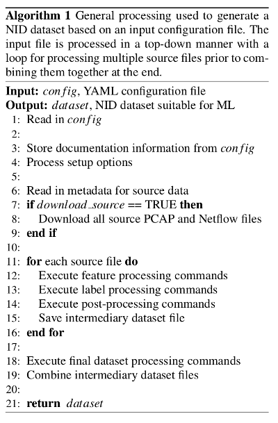
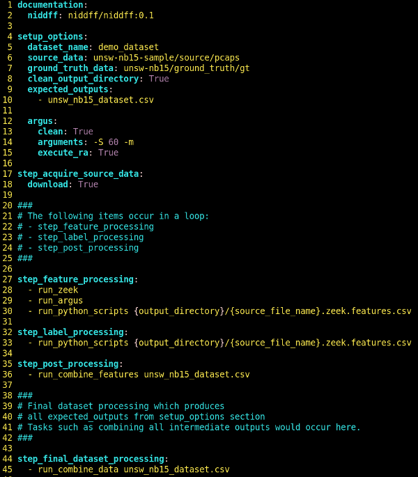

# niddff - Guidelines and a Framework to Improve the Delivery of Network Intrusion Datasets
Full source code repository to accompany the paper "Guidelines and a Framework to Improve the Delivery of Network Intrusion Datasets".

## Installation of Framework
The framework consists of this repository of code in addition to a container environment.
Getting started is relatively simple:

```
git clone git@github.com:WickedElm/niddff.git
docker pull wickedelm/niddff
```

## Getting Started
We have a demo dataset included in the repository called "demo_datset" which can be used as a way to get familiar with using the framework.
The demo dataset constructs a final dataset using a single PCAP from the UNSW-NB15 dataset as its source.
To generate this dataset the following steps can be taken:

```
# Change directories to the cloned repo
cd niddff

# Run the niddff container calling the framework's main script with the demo_dataset config.yaml file as input
# - We map the repo directory to the /niddff volume in the container
# - The container was generated to match user id / group id of 1000
#   Follow the steps "Rebuilding the niddff Container" to change this if desired
docker run -it -v `pwd`:/niddff niddff:0.1  python ./src/create_dataset.py ./datasets/demo_dataset/config.yaml
```

## Dataset Processing Overview
The dataset process consists of executing the ./src/create_dataset.py script with a required argument which is the path to the YAML file for a dataset along with any overrides for values within the config file.
The create_dataset.py script reads in the YAML files and processes commands in a top down manner.
For certain steps, we assume multiple large source files are being processed and so we process them separately and then combine them at the end of the script.
The general algorithm we follow is represented below:



## Configuration File Details
One can review the demo dataset file below and conained in ./datasets/demo_dataset/config.yaml in this repository to get familiar with its contents and section.


### Configuration File Sections

#### documentation
The documentation section is present to store any documentation notes for the dataset.
Currently, we simply put our version of the container being used so that users of the dataset will know what version to use when working with it.
No functionality is currently performed based on this section aside from storing the values during script execution.

#### setup_options
The setup_options section contains important information regarding the dataset which we discuss below in turn.

```
dataset_name:
This is the name of the dataset and must correspond to the directory name in which it is stored.

source_data:
This indicates where to read the source meta data file.
This should be a path to a .meta file within some datasets's source directory.
Note that we do not include the .meta extension here.

In this example, unsw-nb15-sample/sourc/pcaps will inform the script to read in the
./datasets/unsw-nb15-sample/source/pcaps.meta file.

NOTE:  This path can reference a given dataset's own source files or some other
       dataset's source files as done here with our demo dataset.

ground_truth_data:
Similar to source_data, this indicates where to obtain any ground_truth_data.
It is optional, but if used, should be a path to a .meta file in some dataset's
ground_truth directory.

In this example, unsw-nb15/ground_truth/gt refers to the 
./datasets/unsw-nb15/ground_truth/gt.meta file.

NOTE:  This path can reference a given dataset's own source files or some other
       dataset's source files as done here with our demo dataset.

clean_output_directory:
Valid values for this are True or False.
Indicates if the script should recreate the output directory used for holding any
output data produced.

expected_outputs:
This is currently a convenience entry to indicate to users of the dataset which
files will be of interest after constructing the dataset.

We expect to have additional functionality behind this entry in the future but
currently it is just providing the user useful information.
```

#### step_acquire_source_data
During this step, the script reads in the source data and ground truth data specified in the setup_options section of the configuration file.
It then sequentially downloads all of the source and ground truth data locally.

Setting the download field to False in the configuration file or overriding it on the command line will prevent downloading of the data and the script will assume the files are already available locally.

#### step_feature_processing
The entries of this step get executed in a top down manner for each source file used to generate the features of the target dataset.
While our example shows built-in functions such as "run_zeek" one can input arbitrary commands in this section to run.

The expectation is that scripts executed in this section are located in the dataset's step_feature_processing directory.

#### step_label_processing
The entries of this step get executed in a top down manner for each source file used to generate the labels of the target dataset.
While our example shows using the built-in function "run_python" to execute a python script, one can input arbitrary commands in this section to run.

The expectation is that scripts executed in this section are located in the dataset's step_label_processing directory.

#### step_post_processing
The entries of this step are executed in a top down manner for each source file.
These entries are intended to perform any post-processing needed due to the previous step_feature_processing and step_label_processing commands that were run.
For example, we use this step in our demo dataset to combine the features from zeek, argus, and the labels into a single file using the built-in "run_combine_features" function.

#### step_final_dataset_processing
The entries in this step are executed in a top down manner after all of the source data files have been processed.
The intention of entries in this section is the perform any processing needed to produce the final dataset.
In our example, we use this step to combine all of the intermediate files generated for each source file into a final single dataset file using the "run_combine_data" function.

### Command Line Overrides

### Framework Variables

## Dataset Directory Structure

## Supported Tools

### Zeek

### Argus

### Python

## Creating a Dataset

## Rebuilding a Dataset

## Adding/Removing Features

## Rebuilding the niddff Container
In order to re-build the niddff container one can perform the following steps:
```
# The Docker file supports the following arguments:
# ZEEK_VERSION
# ARGUS_VERSION
# PYTHON_VERSION
# USER_ID
# GROUP_ID
#
# NOTE:  If you are rebuilding the container to change tooling, please open a pull request
#        or open an issue so we can collaborate to get it into a common container image.
#
# Assuming you are in the top-level directory of the repo
cd ./containers/niddff/
./build.bash <tag> <any valid arguments to docker-build>
```
